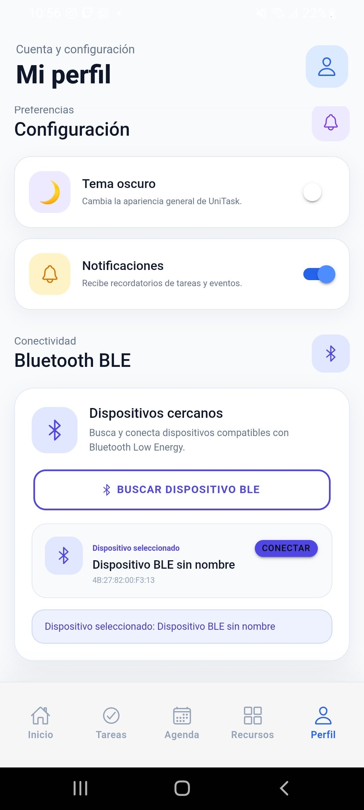
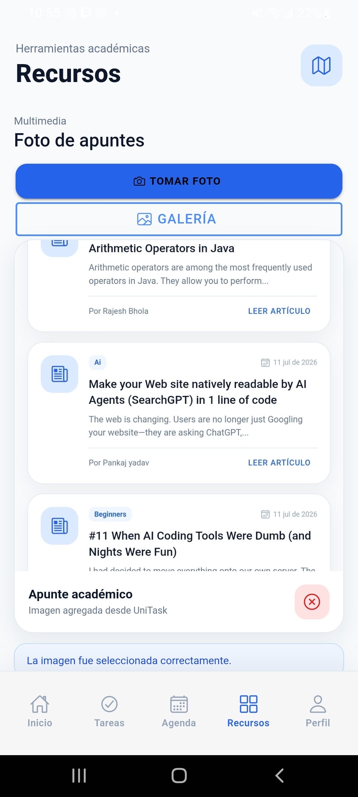
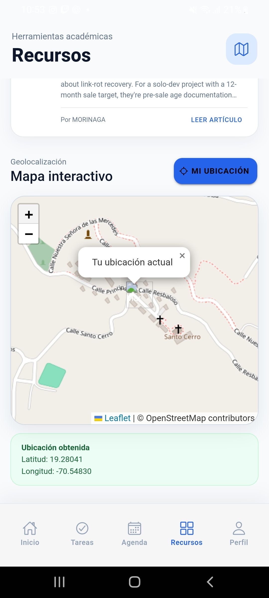
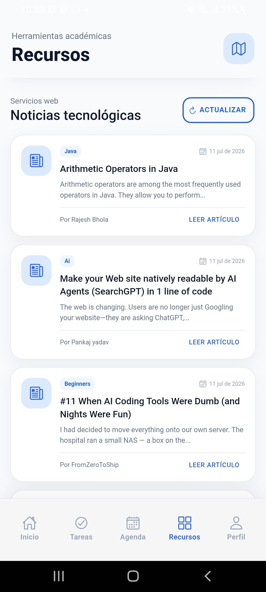
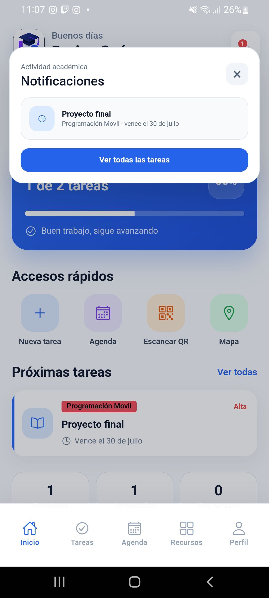
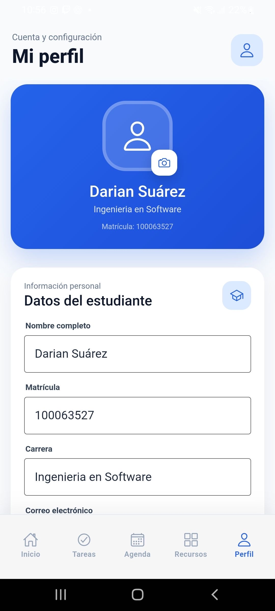
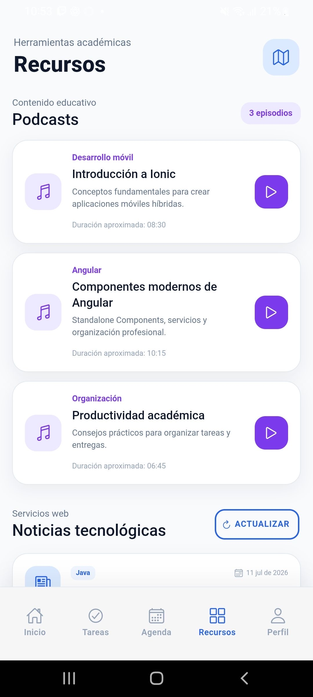
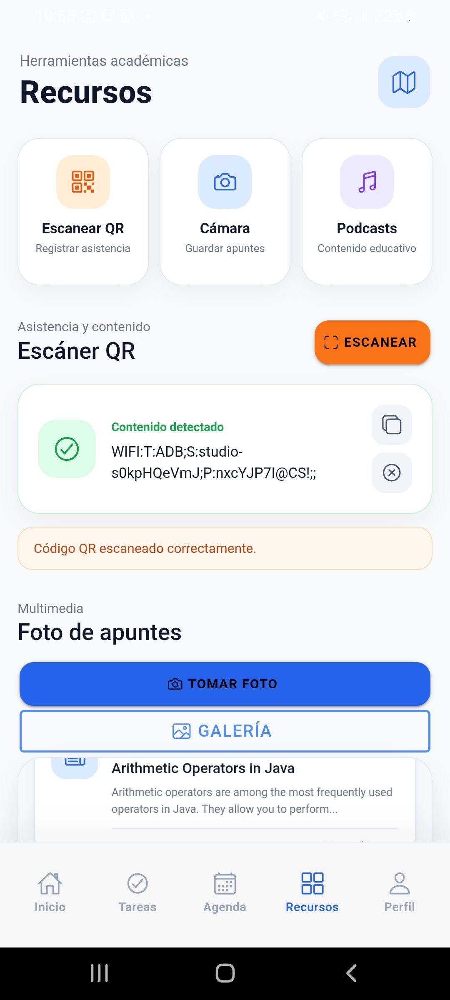
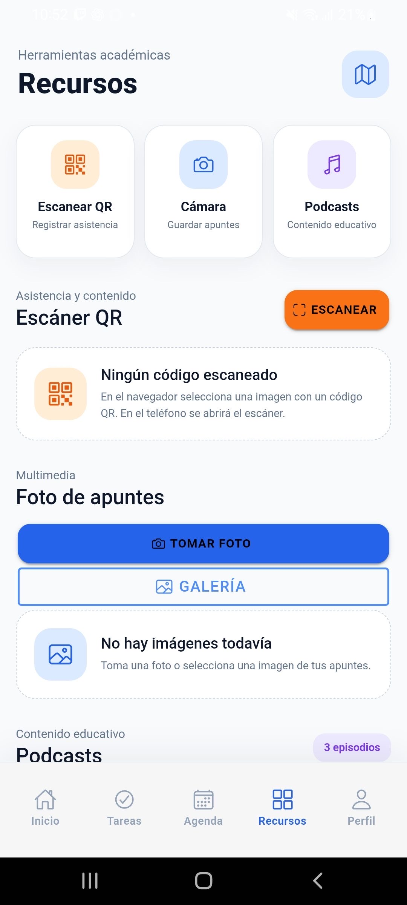

# UniTask

UniTask es una aplicación móvil desarrollada con Ionic, Angular y Capacitor para la organización académica de estudiantes. Integra gestión de tareas, agenda, geolocalización, noticias, escaneo QR, reproducción de podcasts, perfil de usuario y conectividad Bluetooth.

## Características

- Gestión de tareas con CRUD
- Agenda académica
- Noticias mediante API REST
- Mapa con geolocalización (Leaflet + OpenStreetMap)
- Escaneo de códigos QR
- Captura de fotografías
- Reproductor de podcasts
- Perfil de usuario
- Detección de conectividad
- Escaneo de dispositivos Bluetooth LE
- Almacenamiento local persistente

## Tecnologías utilizadas

- Ionic Framework
- Angular
- TypeScript
- Capacitor
- Leaflet
- OpenStreetMap
- Ionic Storage
- HTML5 Audio API

## Plugins utilizados

| Plugin | Función |
|---------|----------|
| @capacitor/geolocation | GPS |
| @capacitor/network | Estado de red |
| @capacitor/camera | Cámara |
| @capacitor/preferences | Preferencias |
| @capacitor-mlkit/barcode-scanning | Escaneo QR |
| @capacitor-community/bluetooth-le | Bluetooth LE |
| @ionic/storage-angular | Almacenamiento local |

## Instalación

```bash
git clone https://github.com/DarianSp/UniTask.git
cd UniTask
npm install
ionic serve
```

## Compilar para Android

```bash
ionic build
npx cap sync android
npx cap open android
```

## Estructura del proyecto

```
src/
 ├── app/
 │   ├── pages/
 │   ├── components/
 │   ├── services/
 │   ├── models/
 │   ├── pipes/
 │   └── core/
 ├── assets/
 └── theme/
```

## Capturas de pantalla

### Agenda académica


### Bluetooth Low Energy



### Cámara y fotografías



### Mapa y geolocalización



### Noticias tecnológicas



### Panel de notificaciones



### Perfil del usuario



### Podcasts educativos



### Escáner QR



### Recursos académicos



## Equipo

| Nombre | Matrícula | Módulo asignado |
|---------|-----------|-----------------|
| Darian de Jesús Suárez Polanco | 100063527 | Desarrollo completo de la aplicación UniTask |

**Universidad Abierta para Adultos (UAPA)**

Proyecto Final — Programación de Dispositivos Móviles

Año: 2026